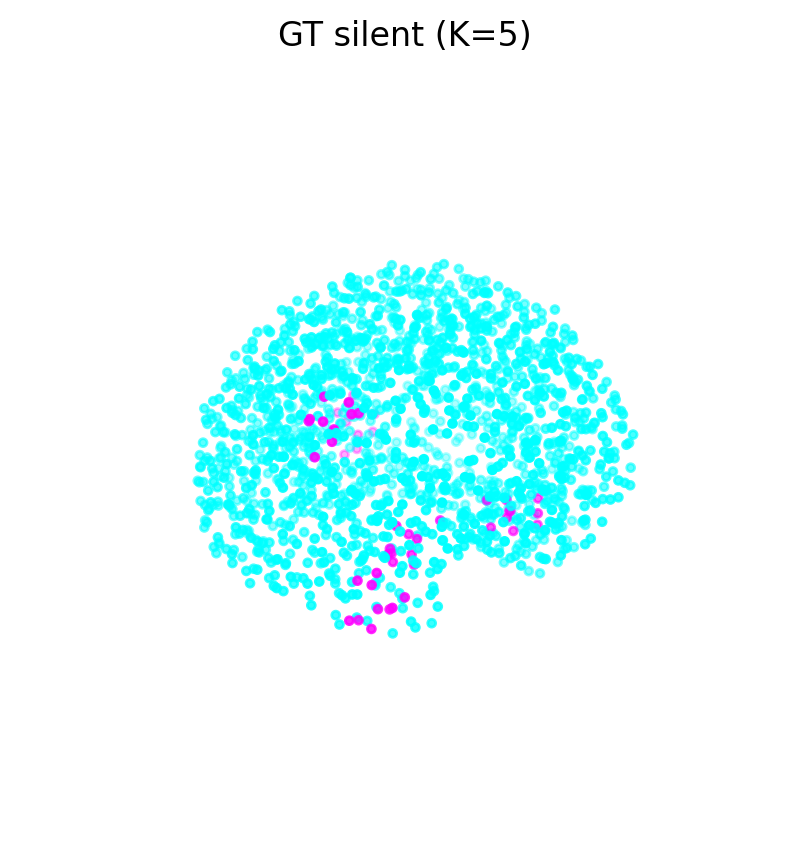
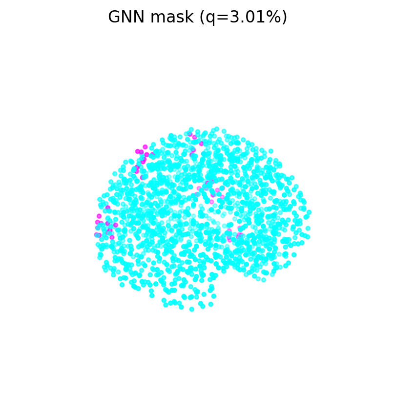

# SilenceMap-Localization
SilenceMap Localization
Created multiple regions of silence. The result is stored in the rep folder. The number of region of silence can vary from 1-5.


# Multi-Region Silence Detection

## Repository Structure
main.py               → Runs the entire pipeline (loading → EEG → beta → graph → Laplacian → GNN → clustering → plots)

dataloader.py         → Loads leadfield & cortex from .mat files or generates synthetic leadfield + coordinates

compute_eeg.py        → Simulates multi-region silence, generates EEG, applies filters, computes SNR

beta.py               → Computes beta values (oracle beta, EEG-based beta, mixing, normalization)

graph.py              → Builds k-NN graph, Gaussian edge weights, Laplacian, and PyTorch sparse adjacency

gnn.py                → Defines the BetaGNN model and Laplacian energy used in self-supervised GNN optimization

clusters_ranking.py   → Extracts silent clusters from GNN/Laplacian masks and ranks them by size & compactness

plotting.py           → Produces all visualizations: cortex masks, GNN clusters, beta/g curves

requirements.txt      → Lists Python dependencies

__init__.py           → Marks the repository as a Python package
''
figs/                 → (Optional) Stores generated figures from the pipeline

---

## 🧪 How to Run

Install dependencies (in a fresh environment):

```bash
pip install -r requirements.txt
```cli
!python /content/SilenceMap-Localization/SilenceMap-Localization/main.py --save_figs --use_mat \
  --leadfield_path /content/sample_data/OT_leadfield_symmetric_1662-128.mat \
  --headmodel_path /content/sample_data/OT_headmodel_symmetric_1662-128.mat
Make sure leadfield and cortex are present

Results for binary beta:
### Ground Truth Silent Regions


### GNN Output


### Ranked Silent Clusters (GNN)


